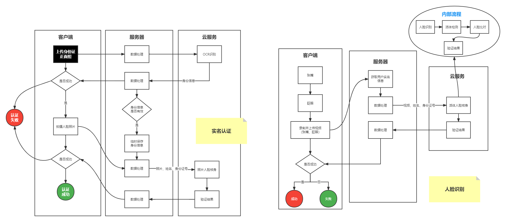

# 方案选择

## 可能用到的功能对比

腾讯云：

- 人脸属性检测：检测人脸和五官位置，张嘴，闭眼等
- 静默活体检测：根据照片判断是否为活体，实际成功率较低
- 动态活体检测：根据视频判断是否为活体

- 活体人脸核身：根据视频与公安权威库照片对比结果判断，视频中的人是否为活体且与权威库中的人一致
- 活体人脸对比：传入视频和照片，对视频中的人与上传照片进行比对
- 照片人脸核身：传入照片和身份信息，判断该照片与权威库的证件照是否属于同一个人

阿里云：

- 人脸属性检测
- 静默活体检测
- 动态活体检测
- 静默人脸对比
- 活体人脸核身：不支持权威库
- 活体人脸对比：不支持权威库

华为云：

- 人脸属性检测
- 静默活体检测
- 动态活体检测
- 静默人脸对比


## 文档健全与易用性

腾讯云：

- 文档排班清晰，所有可能用到的信息都能直白地展示
- 提供在线调试工具
- 接口描述清晰

阿里云：

- 文档排版复杂，寻找信息困难，比如寻找服务端API文档
- 无在线调试工具 / 寻找在线调试工具困难
- 接口文档找不到，更别提接口文档描述

华为云：

- 文档排班清晰，所有可能用到的信息都能直白地展示
- 提供在线调试工具
- 接口描述清晰


## 接入困难度

腾讯云：

- 客户端无需接入SDK
- 服务端需要接入SDK

阿里云：

- 客户端需要接入SDK，不支持H5
- 服务端需要接入SDK

华为云：

- 客户端无需接入SDK
- 服务端需要接入SDK


## 价格对比

腾讯云：1次 / 1元

阿里云：1次 / 1元

华为云：1次 / 1元


## 最终筛选

腾讯云：

- 拥有活体人脸核身这一整套云端整合人脸识别流程的方案，切换公安的权威库与自己的照片库也便捷
- API文档健全、清晰
- 支持H5，无需SDK，客户端及服务端集成都容易
- 亲测接入流程短，效果突出


# 相关文档

## 需要开通的服务

卡证识别：[卡证文字识别_证件文字识别_银行卡文字识别-腾讯云 (tencent.com)](https://cloud.tencent.com/product/cardocr)

人脸核身：[人脸核身_身份认证__实名认证_实人认证-腾讯云 (tencent.com)](https://cloud.tencent.com/product/faceid)


## 服务端配置

秘钥配置：[访问密钥 - 控制台 (tencent.com)](https://console.cloud.tencent.com/cam/capi)

公共参数：[人脸核身 公共参数-调用方式-API 中心-腾讯云 (tencent.com)](https://cloud.tencent.com/document/api/1007/31323)


## 前端传入参数说明

前端需要传入的照片或者视频：格式为`File`

>File：可以通过读取Buffer将其转为Base64，用Base64作为腾讯云接口的参数
>
>为什么用File而不直接用base64：普通类型的请求体有大小限制，需要用`multipart-formData`类型上传文件
>
>需要约定好formData的字段，方便后端读取


## 实名认证

### Step-1：OCR身份证识别

功能概述：[文字识别 卡证文字识别-产品简介-文档中心-腾讯云 (tencent.com)](https://cloud.tencent.com/document/product/866/37491)

API说明文档：[API Explorer - 云 API - 控制台 (tencent.com)](https://console.cloud.tencent.com/api/explorer?Product=ocr&Version=2018-11-19&Action=IDCardOCR&SignVersion=)

### Step-2：照片人脸核身

功能概述：[人脸核身 照片人脸核身-人脸核身PaaS服务相关接口-API 中心-腾讯云 (tencent.com)](https://cloud.tencent.com/document/api/1007/31820)

API说明文档：[API Explorer - 云 API - 控制台 (tencent.com)](https://console.cloud.tencent.com/api/explorer?Product=faceid&Version=2018-03-01&Action=ImageRecognition&SignVersion=)

识别相似度：推荐相似度大于等于70时可判断为同一人，可根据具体场景自行调整阈值（阈值70的误通过率为千分之一，阈值80的误通过率是万分之一）


## 人脸识别

### Step-1：服务端获取实名认证中身份识别保存的身份信息

### Step-2：活体人脸核身

功能概述：[人脸核身 活体人脸核身-人脸核身PaaS服务相关接口-API 中心-腾讯云 (tencent.com)](https://cloud.tencent.com/document/api/1007/31818)

API说明文档：[API Explorer - 云 API - 控制台 (tencent.com)](https://console.cloud.tencent.com/api/explorer?Product=faceid&Version=2018-03-01&Action=LivenessRecognition&SignVersion=)

识别相似度：推荐相似度大于等于70时可判断为同一人，可根据具体场景自行调整阈值（阈值70的误通过率为千分之一，阈值80的误通过率是万分之一）


# 业务流程




# 客户端兼容性问题

最大难处不是如何解决这些问题，而是如何在IOS上调试如何时找到问题的原因

我的调试办法是在所有可能的地方抛出一个消息，在全局用文本显示

详情可看：https://github.com/Lootoe/VideoCapture

- [x] IOS的版本兼容性：IOS13.7及以下无法使用，IOS15.3以上能正常使用

- [x] IOS无法内嵌播放，IOS只展示视频首帧，必须手动操作才能使用**原生相机**播放

  ```js
  // 兼容IOS与微信的小窗播放
  this.video.setAttribute('muted', true)
  this.video.setAttribute('webkit-playsinline', true)
  this.video.setAttribute('playsinline', true)
  ```

- [x] IOS无法正常使用GetUserMedia

  ```js
  if (navigator.mediaDevices === undefined) {
        navigator.mediaDevices = {};
  }
  if (navigator.mediaDevices.getUserMedia === undefined) {
        navigator.mediaDevices.getUserMedia = 
        navigator.getUserMedia || navigator.webkitGetUserMedia || 
        navigator.mozGetUserMedia || navigator.msGetUserMedia || navigator.oGetUserMedia;
  }
  ```

- [x] IOS/微信无法同层渲染，视频会浮于页面顶层

```js
// 兼容微信video同层渲染
// 不要与x5-playsinline同时存在
this.video.setAttribute('x5-video-player-type', 'h5-page')
```

- [x] IOS不支持CaptureStream

```js
const options = { audio: false, video: { facingMode: 'user' } };
const stream = await navigator.mediaDevices.getUserMedia(options)
this.mediaTrack = stream.getTracks()[0]
if ('srcObject' in this.video) {
   this.video.srcObject = stream
} else {
   this.video.src = window.URL && window.URL.createObjectURL(stream) || stream
}
// captureStream IOS 不支持
// const mediaStream = this.video.captureStream(25)
this.recorder = new MediaRecorder(stream)
```

- [x] 微信&IOS无法自动播放：手动点击按钮触发播放
